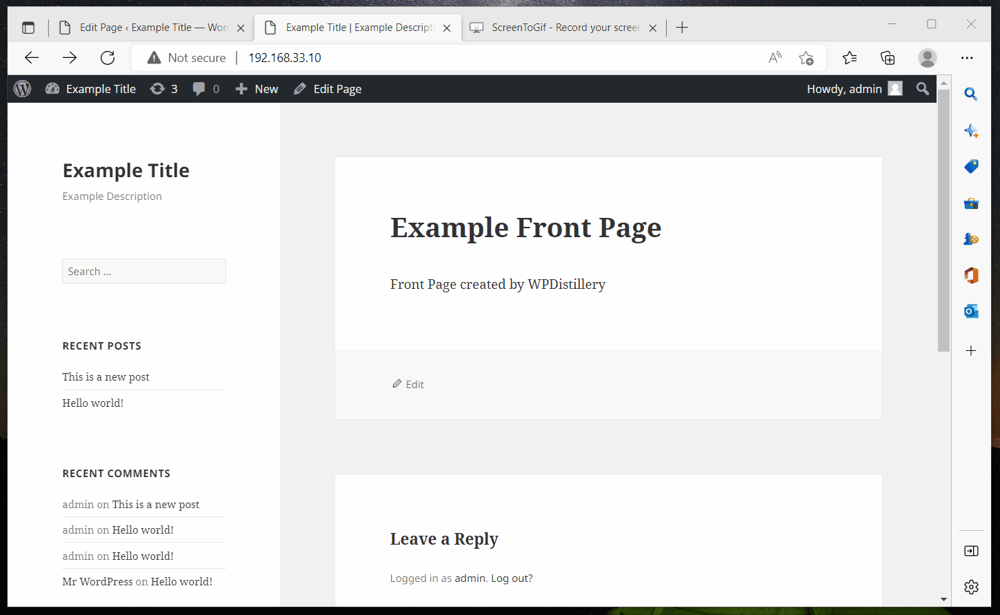
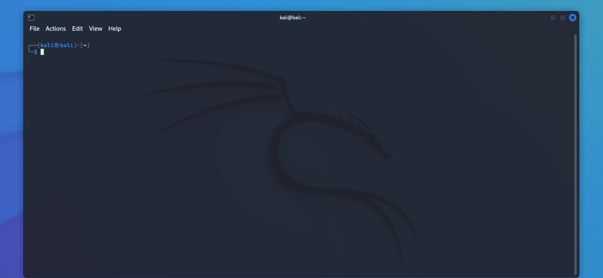

I have tried 3 types of attacks namely XSS, User Enumeration and Password Enumeration. I have attached the gif files of my performing sample attacks.

1)In the XSS attack I used "svg onload=alert(1)" in the comment section of the website
  
  
  
2)In the username enumeration attack I used 
  "wpscan --url http://192.168.33.10 --api-token YOUR_TOKEN -e u vp" 
  in the terminal of my Kali machine to find a list of users on the website and saved it in the usernames.txt file.
  
  
  
3)In the password enumeration attack I hvae created a password.txt file and stored a list of sample passwords in that file. 
  Finally I have performed the following command to find out passwords of the users: 
  wpscan --url http://192.168.33.10 --api-token YOUR_TOKEN --usernames username.txt --passwords password.txt

